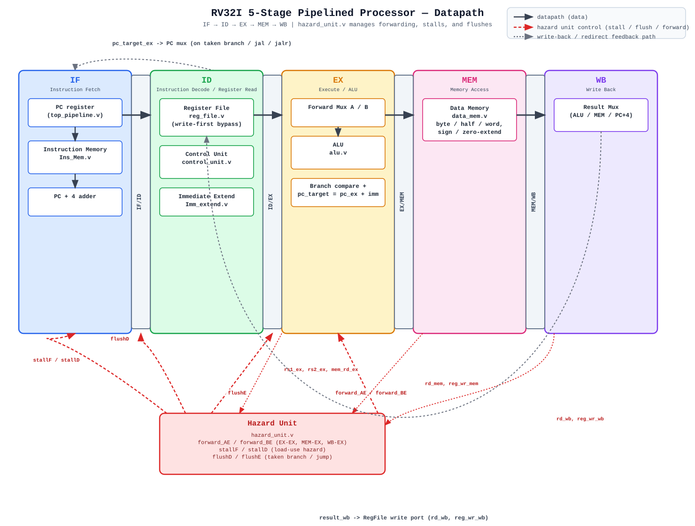

# RV32I 5-Stage Pipelined Processor

A synthesizable, 5-stage pipelined RISC-V (RV32I) core written in Verilog, with full
data-hazard forwarding, load-use stalling, and control-hazard flushing — verified with
a self-checking scoreboard testbench in Icarus Verilog.

```
IF  →  ID  →  EX  →  MEM  →  WB
```

<p align="center">
  
</p>

---

## Status

| | |
|---|---|
| **ISA** | RV32I (base integer, no M/F/D/C extensions) |
| **Pipeline** | Classic 5-stage, in-order, single-issue |
| **Hazard handling** | Full EX-EX / MEM-EX / WB-EX forwarding, load-use stall, branch/jump flush, regfile write-first bypass |
| **Simulator** | Icarus Verilog (`iverilog` / `vvp`) |
| **Verification** | Self-checking scoreboard testbench — **38 / 38 register checks, 6 / 6 memory checks passing** |
| **Waveform** | GTKWave `.vcd` dump included |

> This design went through a real debug pass — see [`BUGS_FOUND.md`](BUGS_FOUND.md) for
> five functional RTL bugs that were found by actually simulating the design (not just
> reading it) and fixed, plus one bug in the testbench itself that was silently skipping
> 8 of its own checks until it was caught.

---

## Architecture

### Pipeline stages

| Stage | Module(s) | Responsibility |
|---|---|---|
| **IF** — Instruction Fetch | `top_pipeline.v` (PC logic), `Ins_Mem.v` | Drives the PC, fetches the instruction, computes `PC+4` |
| **ID** — Instruction Decode | `reg_file.v`, `control_unit.v`, `Imm_extend.v` | Reads source registers, decodes control signals, sign/zero-extends the immediate |
| **EX** — Execute | `alu.v`, forwarding muxes (in `top_pipeline.v`) | ALU op, branch condition evaluation, branch/jump target address computation |
| **MEM** — Memory Access | `data_mem.v` | Load/store to data memory with byte / halfword / word and sign/zero-extension |
| **WB** — Write Back | result mux (in `top_pipeline.v`) | Selects ALU result / memory data / `PC+4` and writes back to the register file |

### Pipeline registers

`if_id_reg.v`, `id_ex_reg.v`, `ex_mem_reg.v`, `mem_wb_reg.v` — each is a synchronous
register with **async active-low reset** and, where applicable, a **flush** input driven
by the hazard unit.

### Hazard unit (`hazard_unit.v`)

| Mechanism | Trigger | Effect |
|---|---|---|
| `forward_AE` / `forward_BE` | `rd_mem`/`rd_wb` matches `rs1_ex`/`rs2_ex` | Bypasses the ALU operand directly from `EX/MEM` or `MEM/WB` instead of stale `ID`-stage register-file data |
| `stallF` / `stallD` | Load-use hazard (`mem_rd_ex` && `rd_ex` matches `rs1_id`/`rs2_id`) | Freezes PC/IF-ID for one cycle and injects a bubble into `ID/EX` |
| `flushD` / `flushE` | Taken branch or jump resolved in EX | Squashes the two instructions fetched on the wrong-path (fall-through) side of a taken branch/jump |
| Register-file write-first bypass (`reg_file.v`) | RAW hazard with an exact 3-instruction gap (producer's WB lands on the same edge as consumer's ID read) | Forwards the value being written directly to the read port combinationally |

Branches and jumps resolve in **EX**, giving a standard 2-cycle penalty on a taken
branch (1 filler instruction squashed in `ID`, 1 wasted fetch squashed in `IF`, before
the redirected fetch lands cleanly).

---

## Repository layout

```
.
├── docs/
│   └── architecture.svg        # datapath diagram (the one above)
├── alu.v                       # ALU: add/sub/and/or/xor/sll/srl/sra/slt/sltu
├── control_unit.v              # main decoder: opcode/funct3/funct7 -> control signals
├── data_mem.v                  # byte/half/word addressable data memory
├── hazard_unit.v               # forwarding, stall, and flush logic
├── Imm_extend.v                # I/S/B/J/U immediate generation
├── Ins_Mem.v                   # instruction ROM (directed test program, see below)
├── reg_file.v                  # 32x32 register file with write-first bypass
├── top_pipeline.v              # top-level: wires all stages + pipeline regs together
├── if_id_reg.v                 # IF/ID pipeline register
├── id_ex_reg.v                 # ID/EX pipeline register
├── ex_mem_reg.v                # EX/MEM pipeline register
├── mem_wb_reg.v                # MEM/WB pipeline register
├── tb_top_pipeline.v           # self-checking scoreboard testbench
├── BUGS_FOUND.md               # write-up of every bug found + fix, with evidence
└── README.md
```

---

## Instruction coverage

`Ins_Mem.v` is a directed test program (not a general-purpose loader — this core has no
assembler/toolchain integration yet) covering:

- **R-type**: `add sub and or xor sll srl sra slt sltu`
- **I-type**: `addi`
- **Loads**: `lw lb lbu lh lhu` (sign/zero-extension both tested)
- **Stores**: `sw sb sh`
- **Branches**: `beq bne blt bge bltu bgeu` — both taken and not-taken paths
- **Jumps**: `jal jalr`
- **U-type**: `lui auipc`
- **Directed hazard cases**: back-to-back RAW (EX-EX forwarding), 2-instruction-gap RAW
  (MEM-EX forwarding), load-use stall, and the 3-instruction-gap register-file bypass
  case that turned out to be a real bug (see `BUGS_FOUND.md`)

---

## Running the simulation

Requires [Icarus Verilog](http://iverilog.icarus.com/):

```bash
iverilog -g2012 -o sim.vvp \
    alu.v control_unit.v data_mem.v hazard_unit.v Imm_extend.v Ins_Mem.v \
    reg_file.v top_pipeline.v ex_mem_reg.v id_ex_reg.v if_id_reg.v mem_wb_reg.v \
    tb_top_pipeline.v

vvp sim.vvp
```

Expected tail of the output:

```
================= REGISTER SCOREBOARD =================
Checked : 38 / 38 expected writes
Passed  : 38
Failed  : 0

================= MEMORY CHECKS =======================
...
================= FINAL SUMMARY ========================
>>> ALL CHECKS PASSED (38 register checks, 6 memory checks) <<<
```

### Viewing waveforms

The testbench dumps `tb_top_pipeline.vcd` on every run:

```bash
gtkwave tb_top_pipeline.vcd
```

Useful signals to add: `dut.pc`, `dut.instrD`, `dut.rd_ex/rd_mem/rd_wb`,
`dut.forward_AE/forward_BE`, `dut.stallF/stallD`, `dut.flushD/flushE`, `dut.result_wb`.

---

## Testbench design notes

`tb_top_pipeline.v` is a **scoreboard**, not a final-register-snapshot check: it watches
the write-back port (`reg_wr_wb`, `rd_wb`, `result_wb`) every cycle and compares it, in
program order, against a golden list of expected `(rd, value)` pairs. Because squashed
instructions never assert `reg_wr_wb`, the scoreboard naturally skips over flushed
branch/jump fillers without needing to hand-track flush timing. Store instructions
(which never touch the register file) are checked separately via direct data-memory
peeks.

---

## Known limitations / not yet implemented

- No exceptions/interrupts, CSRs, or privileged modes
- No M-extension (mul/div), no compressed (C) instructions
- No I-cache/D-cache — single-cycle combinational memories
- No branch predictor — every branch/jump costs a fixed 2-cycle penalty
- `Ins_Mem.v` is a fixed ROM for verification, not a program loader

## License

Add a license of your choice (MIT is a common default for course/portfolio projects
like this).
